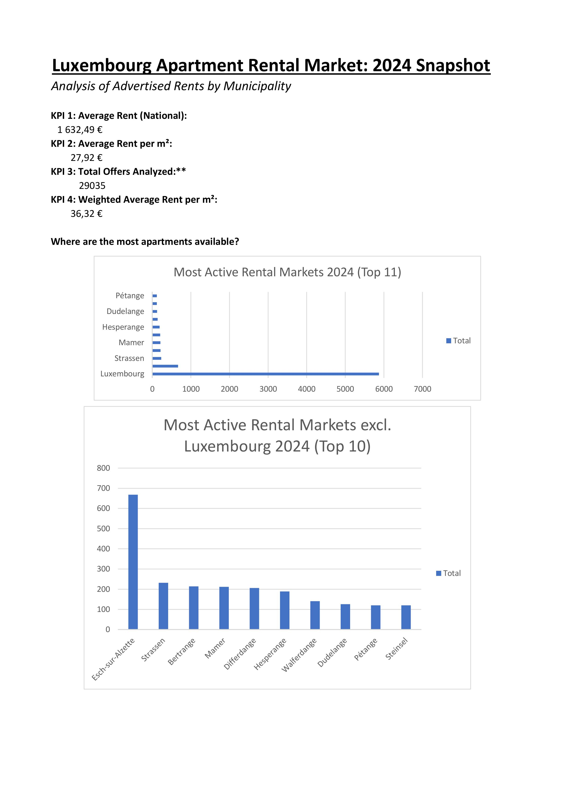
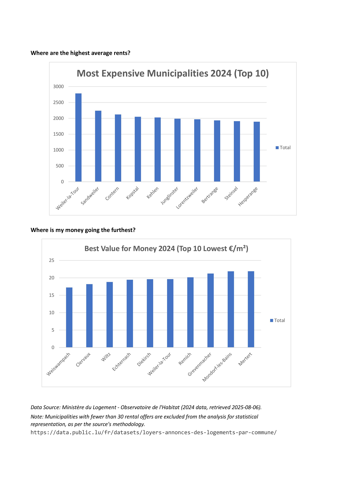
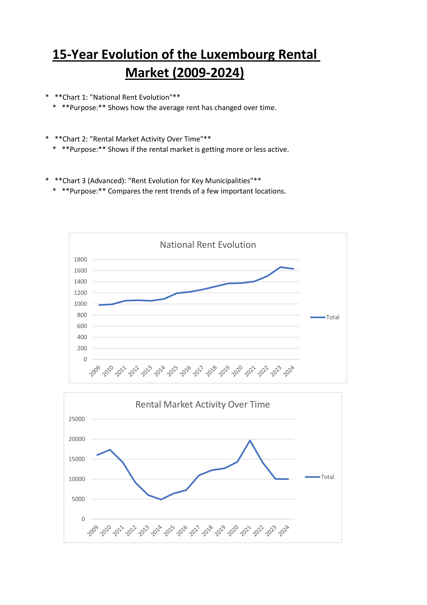
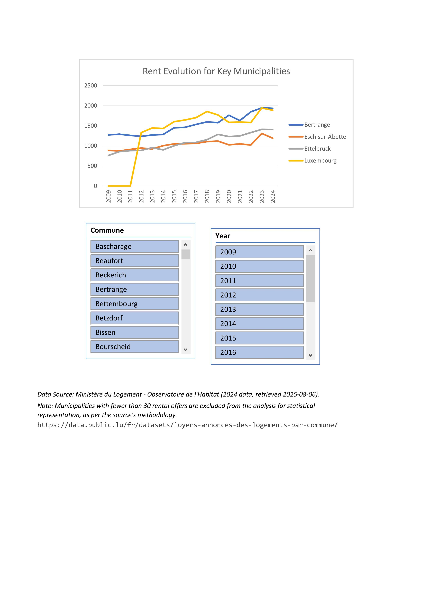

# **Luxembourg Apartment Rental Market Analysis (2009-2024)**

## **1. Business Objective**

The goal of this project was to analyze the Luxembourg apartment rental market by cleaning, transforming, and visualizing 15 years of publicly available data. The final deliverable is a set of interactive Excel dashboards designed to provide insights into both the current state (2024) and the long-term evolution of rental prices and market activity across the country's municipalities.

## **2. The Data**

The dataset was sourced from the official Luxembourg public data portal, provided by the *Ministère du Logement - Observatoire de l'Habitat*.

-   **Source:** [data.public.lu](https://data.public.lu/fr/datasets/loyers-annonces-des-logements-par-commune/)
-   **Format:** The raw data was provided in an `.xls` file with separate sheets for each year from 2009 to 2024.

## **3. Tools Used**

-   **Microsoft Excel:** Core tool for analysis, visualization, and dashboarding.
-   **Power Query:** Used for the entire ETL (Extract, Transform, Load) process.
-   **Pivot Tables & Pivot Charts:** Primary tools for data aggregation and visualization.

[Download the full interactive Excel Dashboard here](https://docs.google.com/spreadsheets/d/1gVOSNHWLajXGg7O_Qu0IRpR78_kMvrAP/edit?usp=sharing&ouid=107403495220001874026&rtpof=true&sd=true)

## **4. ETL Process: From Raw Report to Clean Data**

The raw data was in a format unsuitable for analysis, containing metadata, blank rows, and inconsistent formatting across 16 separate sheets. The following steps were taken in Power Query to create a single, clean master table:

1.  **Transformation:** A custom Power Query function was developed to perform the necessary cleaning steps: removing irrelevant top and bottom rows, promoting headers, replacing non-numeric values (e.g., `*`) with `null`, and setting correct data types for all columns.
2.  **Enrichment:** A "Year" column was added to each sheet's data *before* combining them to enable time-series analysis.
3.  **Consolidation:** The 16 cleaned, yearly tables were then **appended** into a single, analysis-ready master table containing all data from 2009 to 2024.

### **Data Limitations**
The analysis treats each municipality as a consistent entity over time. It does not account for municipal fusions that occurred in 2012, 2015, 2018 and 2023. A future "Version 2" of this analysis could build a concordance file to map historical data to the current municipal boundaries for a more precise longitudinal comparison.

## **5. Analysis & Dashboards**

Two separate dashboards were created to tell two distinct stories: a snapshot of the current market and a view of its long-term evolution.

### **Dashboard 1: 2024 Snapshot**
This dashboard provides an overview of the rental market using the most recent data.

**Key Insights:**

-   **Extreme Market Concentration:** The rental market is heavily concentrated, with **Luxembourg-Ville** alone accounting for over **57%** of all listings in 2024. The top 10 most active municipalities make up nearly 80% of the entire market.
-   **Price Disparity:** There is a significant difference between the most and least expensive municipalities. In 2024, **Weiler-la-Tour** had the highest average rent at **€2,785**, while municipalities in the north like **Weiswampach** and **Clervaux** offered the best value for money at under **€19/m²**.

### **Dashboard 2: 15-Year Evolution (2009-2024)**
This dashboard focuses on trends and changes over the past decade and a half.

**Key Insights:**

-   **Consistent Rent Appreciation:** The national average rent has shown a steady and significant increase over the past 15 years, rising from approximately **€1,128 in 2009** to **€1,632 in 2024**.
-   **Volatile Market Activity:** Unlike prices, the number of rental offers has been volatile, peaking in 2011 and again in 2021 before declining in recent years.
-   **Diverging Paths:** While all key municipalities have seen rents increase, the rate of increase varies. **Luxembourg-Ville** has consistently remained the most expensive, while other economic centers like **Esch-sur-Alzette** and **Ettelbruck** have followed a similar but less steep upward trend.

## **6. Summary & Recommendations**

This analysis provides a clear, data-driven view of the Luxembourg rental market. Key takeaways include the market's heavy reliance on the capital city, a consistent long-term trend of rising costs, and significant geographical disparities in both price and value.

